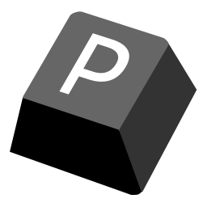
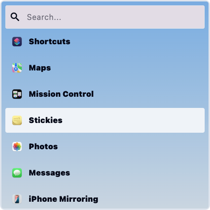
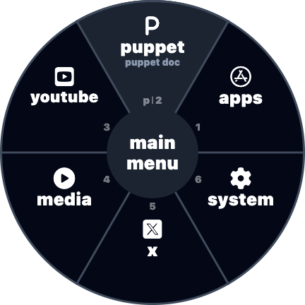
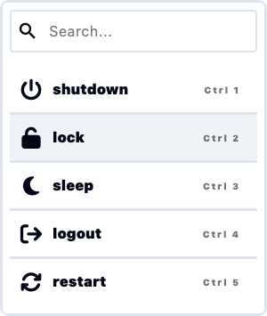

<p align="center">
  
</p>

# Puppet
Puppet is a cross-platform dynamic menu system driven by WASM plugins. Create application launchers, window switchers, and more!

<p align="center" style="display: flex; justify-content: center; gap: 10px; flex-wrap: wrap; max-width: 800px; margin: 0 auto;">
  
  
  
</p>

**Key Features:**

-   **Dynamic Menus:** User-defined menus with wheel or list layouts.
-   **WASM Plugins:** Extend functionality using Extism.
-   **Customizable:** Themes, hotkeys, and more.


**How it Works:**

1.  Open menu via hotkey.
2.  Plugins generate menu items.
3.  Puppet displays items.
4.  User selects an item.
5.  Plugin handles the selection.

**Plugin Highlights:**

-   Written in any Extism PDK language.
-   `init()`, `filter()`, `on_selected()` functions.
-   `cli_run()` host function for running commands.
-   `manifest.json` for configuration and permissions.

**Publishing Plugins:**

1.  Create a release with `plugin.wasm`, `manifest.json`, and `readme.md`.
2.  Add your plugin to `plugins.json` in the [puppet-plugins](https://github.com/Mr-1311/puppet-plugins) repository.

## Building from Source

### Prerequisites

- Flutter SDK
- Rust toolchain
- for linux install keybinder3 and gtk-layer-shell

### Build Steps

Use the included build script:

```bash
./build.sh
```

## License
MIT
